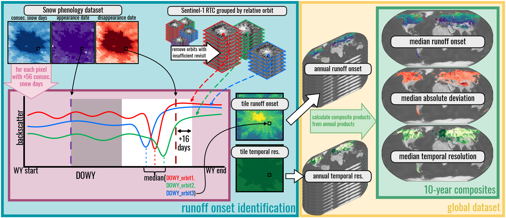
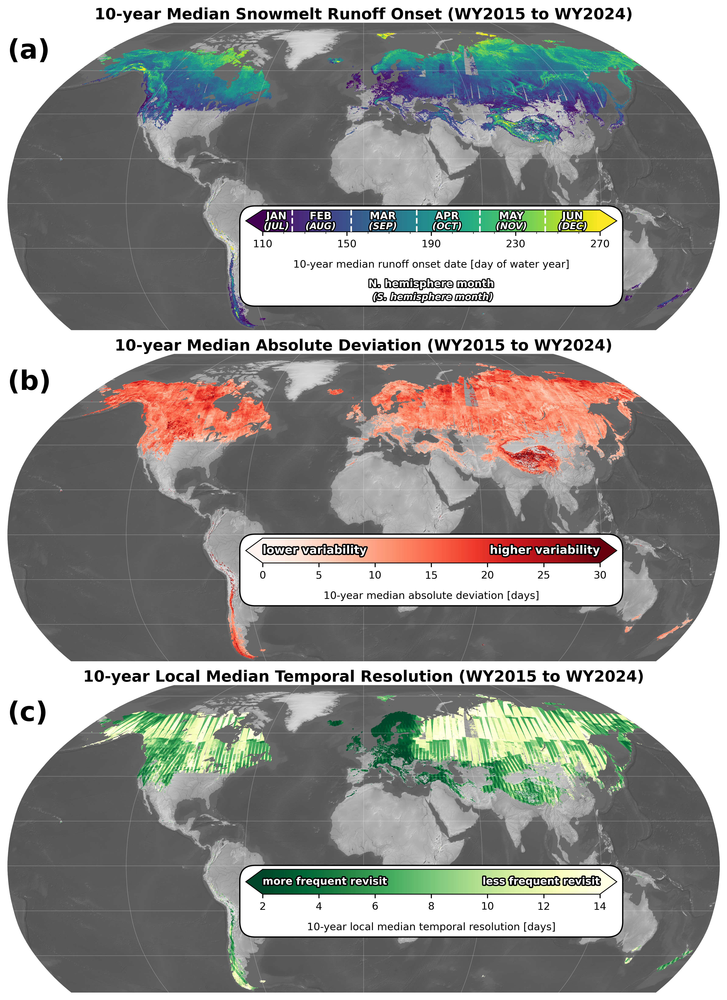
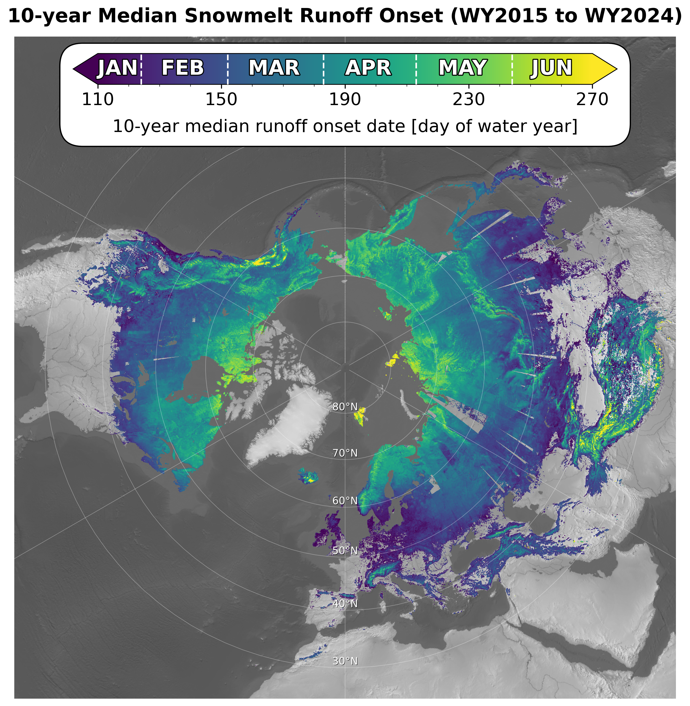
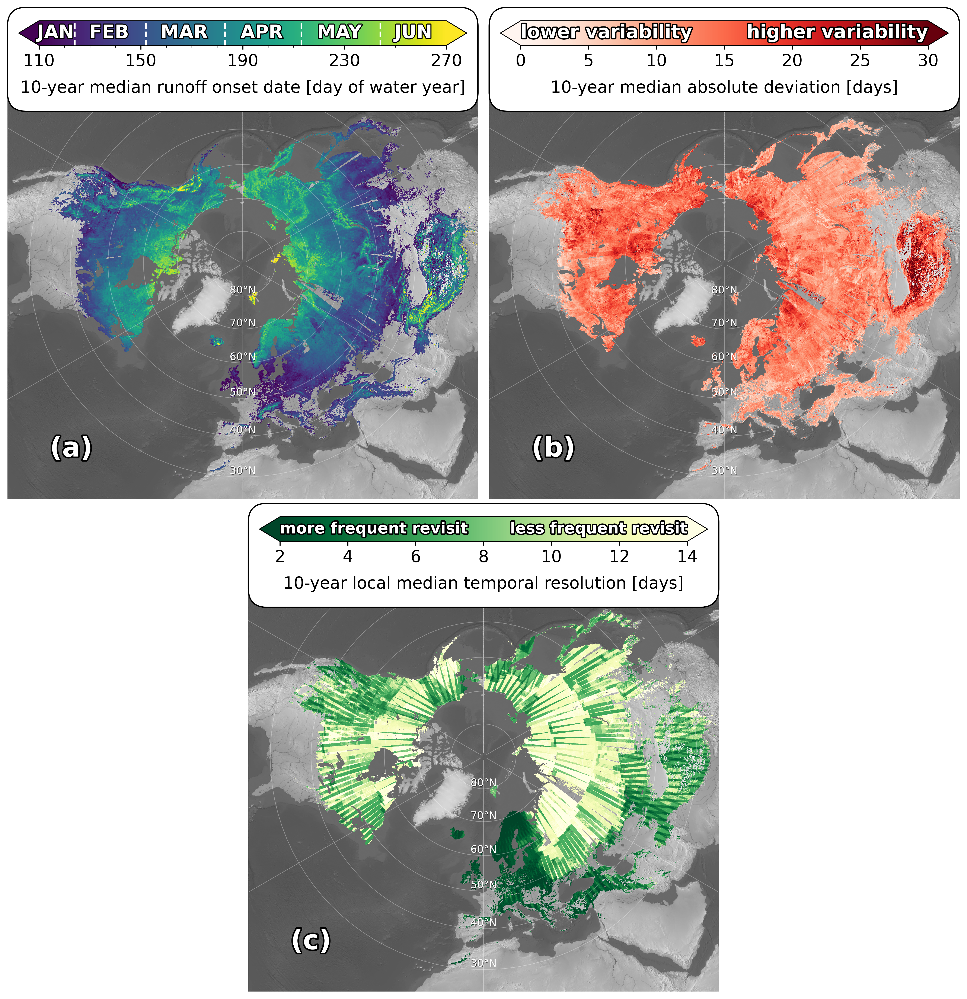
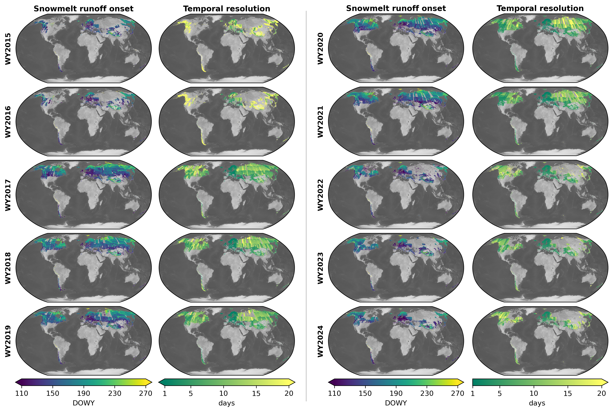

# Global snowmelt runoff onset from Sentinel-1 SAR, 2015-2024

[](https://doi.org/10.5281/zenodo.19115464)


Eric Gagliano (egagli@uw.edu)

---

## Overview

Global 80-meter resolution dataset of snowmelt runoff onset timing from Sentinel-1 SAR and MODIS snow phenology, spanning water years 2015-2024. Evaluated against snow pillows at 1,116 automated weather stations (Western U.S., British Columbia, Norway, Nepal): median timing difference −2.0 days, median absolute deviation 10.0 days. (The in-production v10 rebuild extends the record to WY2015–2025; the published dataset and manuscript cover WY2015–2024.)

## Key features

- **80m global coverage** from 81.1°N to 60°S (data extent; the v10 processing grid spans 84.05°N–63.41°S, reserving room for the high Arctic and the Antarctic Peninsula)
- **10-year record** (2015-2024) with annual and composite products  
- **Validated performance** (0 days median bias, 10 days typical uncertainty)
- **Usage guidelines** for optimal performance by environment
- **Cloud-optimized** Zarr format for efficient access

## Methodology

SAR backscatter minima from Sentinel-1 indicate snowmelt runoff onset when liquid water content peaks during the transition from snow ripening to active runoff. We combine multi-orbit Sentinel-1 data with MODIS snow phenology to constrain detection timing and location.

**Key steps:**
1. Create MODIS-derived snow phenology dataset (≥56 days continuous snow)
2. Quality filter Sentinel-1 VV backscatter and relative orbits  
3. Detect backscatter minima within latter half of snow-covered periods
4. Aggregate across orbits using median statistics
5. Generate annual maps and 10-year composites

## Performance

**Optimal conditions** (forest cover <0.5, SWE >25cm, temporal resolution <2 weeks):
- Uncertainty: ~1 week
- Bias: minimal

**Avoid** (dense forest + low SWE + poor temporal resolution):
- Uncertainty: >1 month  
- Systematic early bias

**Limitations:** Unreliable in dense forests (>50% cover), low snow areas (<25cm SWE), and sublimation-dominated regions (>5000m elevation).

## Data products

| Variable | Description | Dimensions | Units |
|----------|-------------|------------|-------|
| `runoff_onset` | Annual runoff onset timing | (water_year, lat, lon) | Day of water year |
| `runoff_onset_median` | 10-year median timing | (lat, lon) | Day of water year |
| `runoff_onset_mad` | 10-year variability | (lat, lon) | Days |
| `temporal_resolution` | Annual sampling frequency | (water_year, lat, lon) | Days |
| `temporal_resolution_median` | 10-year median sampling frequency | (lat, lon) | Days |

**Format:** Cloud-optimized Zarr, 80m resolution, WGS84, -9999 no-data values

## Data access

- **Published dataset:** [Zenodo DOI - to be added]
- **Snow phenology:** [https://zenodo.org/records/15692530](https://zenodo.org/records/15692530)  
- **Source code:** [https://github.com/egagli/global_snowmelt_runoff_onset](https://github.com/egagli/global_snowmelt_runoff_onset)

## Repository structure

This repository is the single home for everything behind the manuscript — dataset creation, dataset evaluation, and figure/table generation. Every folder has its own `README.md` with more detail; this table maps manuscript content to where it lives.

```text
global_snowmelt_runoff_onset/
├── global_snowmelt_runoff_onset/   # core Python package (config, processing, plotting)
├── processing/                     # tile-based dataset creation pipeline + GH Actions scripts
├── dataset/                        # references to the published Zarr store
├── dataset_utils/                  # utilities for accessing/subsetting/exporting the published dataset
├── dataset_evaluation/             # evaluation against snow pillows, NorSWE, passive microwave, etc.
├── visualize/                      # global composite figures (Fig. 2, 3, A2, A3, A4) + methods figure (Fig. 1)
├── interactive_map/                # planning doc for a web map of the dataset (no code yet)
├── config/                         # versioned processing configuration files
└── .github/workflows/              # GitHub Actions tile-processing pipeline
```

### Manuscript figures

Previews below are the checked-in **v9** renders (the manuscript versions). Where a v10 regeneration already exists it is noted; `dataset_evaluation/compare_to_snotel/` is currently untracked, so Fig. A1 has no preview here.

| Figure | Preview | Created in | Output file |
| --- | --- | --- | --- |
| **Fig. 1** — workflow diagram |  | [`visualize/methods/create_methods_figure_components.ipynb`](visualize/methods/create_methods_figure_components.ipynb) (panels) + [`combine_methods_figure_components.ipynb`](visualize/methods/combine_methods_figure_components.ipynb) | `visualize/methods/figures/methods_figure.png` |
| **Fig. 2** — global composite products (median onset, MAD, temporal resolution) |  | [`visualize/global/global_composites.ipynb`](visualize/global/global_composites.ipynb) | `visualize/global/figures/global_all_composites_robinson_wide.png` (`_long.png` = alternate aspect ratio) |
| **Fig. 3** — NH polar stereographic median onset |  | [`visualize/global/global_composites.ipynb`](visualize/global/global_composites.ipynb) | `visualize/global/figures/global_composite_median_polar.png` |
| **Fig. 4** — residual bias/spread binned by forest cover fraction × SWE × temporal resolution |  | [`dataset_evaluation/compare_to_all_public_snow_pillows/2_compare_snow_pillows.ipynb`](dataset_evaluation/compare_to_all_public_snow_pillows/2_compare_snow_pillows.ipynb) | `figures/<version>/pixelwise_performance_analysis.png` (+ `_WUS`/`_nonWUS`; v10 rendered) |
| **Fig. 5** — station evaluation (per-year residuals + bias map) |  | [`dataset_evaluation/compare_to_all_public_snow_pillows/3_evaluate_snow_pillows.ipynb`](dataset_evaluation/compare_to_all_public_snow_pillows/3_evaluate_snow_pillows.ipynb) | `figures/<version>/snow_pillow_evaluation_..._no_violin_regional_insets.png` (+ `_WUS`/`_nonWUS`; v10 rendered) |
| **Fig. 6** — passive microwave comparison, Alaska Range WY2020 |  | [`dataset_evaluation/compare_to_passive/alaska_range_comparison.ipynb`](dataset_evaluation/compare_to_passive/alaska_range_comparison.ipynb) | `figures/v9/alaska_range_passive_comparison.png` (still v9-pinned) |
| **Fig. A1** — single-station high-/low-SWE case study | *(untracked dir)* | [`dataset_evaluation/compare_to_snotel/supplemental_figure_methodology_explain_pos_bias_at_low_fcf_high_SWE.ipynb`](dataset_evaluation/compare_to_snotel/supplemental_figure_methodology_explain_pos_bias_at_low_fcf_high_SWE.ipynb) (note: this notebook — not `supplemental_figure_methodology.ipynb` — writes the file) | `figures/v9/supplemental_figure_methodology.png` |
| **Fig. A2** — NH polar stereographic, all three composites |  | [`visualize/global/global_composites.ipynb`](visualize/global/global_composites.ipynb) | `visualize/global/figures/global_all_composites_polar.png` |
| **Fig. A3** — annual onset + temporal resolution maps, WY2015–2024 |  | [`visualize/global/global_annual_runoff_onset_and_temporal_res.ipynb`](visualize/global/global_annual_runoff_onset_and_temporal_res.ipynb) | `visualize/global/figures/global_annual_runoff_onset_and_temporal_res_with_hillshade_2015_2024.png` |
| **Fig. A4** — per-pixel count of valid water years |  | [`visualize/global/global_composites.ipynb`](visualize/global/global_composites.ipynb) | `visualize/global/figures/global_10yr_annual_runoff_onset_count.png` |
| **Fig. A5** — snow-pillow network representativeness by snow class |  | [`dataset_evaluation/compare_to_all_public_snow_pillows/4_snow_pillow_representativeness.ipynb`](dataset_evaluation/compare_to_all_public_snow_pillows/4_snow_pillow_representativeness.ipynb) | `figures/<version>/snow_pillow_representativeness_snow_class_map_and_pixel_counts.png` (**no v10 render yet** — the notebook's `VERSION` was stuck at `v9` until 2026-08-04; rerun to produce it) |

### Manuscript tables & calculated numbers

Values as currently checked in. "v9" = the published/manuscript dataset; where the v10 rerun already gives a different number it is listed so the manuscript update can pick it up.

| Manuscript item | Value (checked-in) | Calculated in | Where the number lives |
| --- | --- | --- | --- |
| **Table 1** — per-water-year spatial coverage, seasonal snow extent, % coverage, avg temporal resolution | Composite row: **36,761,636 km²** coverage of **40,863,365 km²** total seasonal snow extent = **90.0%**, avg temporal resolution **9.5 days**. Per-WY values (26.4%/16.5d in 2015 → 41.6%/10.6d in 2024) match the manuscript exactly. | [`calculate_spatial_coverage_and_temporal_resolution.ipynb`](dataset_evaluation/calculate_spatial_coverage_and_temporal_resolution/calculate_spatial_coverage_and_temporal_resolution.ipynb) | [`results/v9/complete_spatial_coverage_and_temporal_res_per_water_year_REVISED.csv`](dataset_evaluation/calculate_spatial_coverage_and_temporal_resolution/results/v9/complete_spatial_coverage_and_temporal_res_per_water_year_REVISED.csv) — one row per water year + `composite`; Table 1's percentages are the `percent_coverage_of_total_seasonal_snow_extent` column (the non-`_REVISED` CSV lacks the excluded-polar-area denominator) |
| **Sect. 3.3** — "~1.6 million km² of seasonal snow" excluded (no S1 IW coverage) | **1,663,126 km²** total: Greenland 363,919 + Canadian Arctic Archipelago 1,235,852 + Russian Arctic 9,080 + Antarctica 54,274 | [`how_much_seasonal_snow_do_we_miss.ipynb`](dataset_evaluation/calculate_spatial_coverage_and_temporal_resolution/how_much_seasonal_snow_do_we_miss.ipynb) | [`results/v9/seasonal_snow_excluded_area_summary.csv`](dataset_evaluation/calculate_spatial_coverage_and_temporal_resolution/results/v9/seasonal_snow_excluded_area_summary.csv) — one row per region + "Total Excluded Area" |
| **Abstract / Sect. 4.2** — evaluation headline stats | Median residual **−2.0 days**, MAD **10.0 days** (v10 outputs match the manuscript). Station counts differ: manuscript says **7,294 station-WYs across 1,116 of 1,210 stations** (v9, WY2015–2024); the current v10 rerun (WY2015–**2025**) gives **8,397 station-WYs across 1,135 stations** (WUS 931 stations / 7,242 obs; non-WUS 204 / 1,155; mean temporal resolution 6.87 d). Reconcile when updating the manuscript. | [`3_evaluate_snow_pillows.ipynb`](dataset_evaluation/compare_to_all_public_snow_pillows/3_evaluate_snow_pillows.ipynb) (filters: fcf ≤ 0.5, max SWE ≥ 20 cm, temporal res ≤ 14 d, radius ≤ 1000 m, WorldCover 50/80 excluded) | **Printed cell outputs only — not saved to any file.** The station-count banner prints `***8,397 water-year observations with valid runoff onset estimates across 1,135 stations***`; the residual-stats cell prints `Residuals median: -2.0` / `Residuals MAD: 10.0` / `Mean temporal res: 6.87`; two later cells print the `WUS:` / `non-WUS:` splits. Per-water-year n/res/median/MAD are also annotated as text on the Fig. 5 PNG itself |
| **Sect. 2.3** — snow-pillow QC counts | Manuscript: **9,570 WY observations across 1,210 stations** (v9). Current v10 rerun: **10,566 valid station-years across 1,234 stations** (of 1,292 stations with SWE data, WY2015–2025; 1,542 stations in the raw Zarr). | [`1_create_snow_pillow_comparison_dataset.ipynb`](dataset_evaluation/compare_to_all_public_snow_pillows/1_create_snow_pillow_comparison_dataset.ipynb) (QC filters: SWE ≥ 10 cm, ≥ 60 continuous snow days, gaps ≤ 10 d) | **Printed cell output only — not saved to any file.** The QC-summary cell prints `***10566 valid station-years across 1234 stations (of 1292 stations x 11 water years)***` |
| **Sect. 4.1** — quality-filter thresholds | forest cover fraction **< 0.5**, water-year max SWE **> 20 cm**, temporal resolution **< 14 days** | Read off the Fig. 4 binned heatmaps in [`2_compare_snow_pillows.ipynb`](dataset_evaluation/compare_to_all_public_snow_pillows/2_compare_snow_pillows.ipynb) (a judgment call, not a computed output) | Encoded as the filter constants at the top of [`3_evaluate_snow_pillows.ipynb`](dataset_evaluation/compare_to_all_public_snow_pillows/3_evaluate_snow_pillows.ipynb) (`fcf_lte = 50`, `max_swe_gte = 200`, `temp_res_lte = 14`, `radius_lte = 1000`, `exclude_worldcover = [50, 80]`), and baked into the Fig. 5 output filename |
| **Sect. 2.2.3** — processing scale | v9 (manuscript): **23,520 tiles**, **4,453 processed**, median **~4.7 CPU-core-hours/tile**, **~24,300 core-hours** total, **>100 TB** S1 input. v10 grid: **24,500 tiles (100 × 245)**, **4,227** to process (2026-08-03 registry probe). | Tile counts: [`processing/select_tiles_to_process.ipynb`](processing/select_tiles_to_process.ipynb); core-hours: [`dataset_utils/compress_and_download_zarr.ipynb`](dataset_utils/compress_and_download_zarr.ipynb) | 23,520 = the 96 × 245 v9 grid (`config/global_config_v9.txt`). **4,453** = unique tiles with a non-empty `runoff_onsets_dims` in [`processing/tile_data/tile_results_v9.csv`](processing/tile_data/tile_results_v9.csv) (of 4,783 seasonal-snow tiles in the v9 registry geojson). Core-hours: printed cell output in `compress_and_download_zarr.ipynb` (`CPU-core-hours per tile: median=4.7, mean=5.5` / `Total CPU-core-hours: 24279`), computed from that same CSV. ">100 TB" is a stated estimate, not computed in this repo. v10: `to_process` counts in [`processing/tile_data/global_tiles_with_seasonal_snow_v10.geojson`](processing/tile_data/global_tiles_with_seasonal_snow_v10.geojson) |
| **Sect. 3.1** — grid dimensions | v9 (manuscript): latitude **195,970** × longitude **499,998**, 81.1°N–60°S. v10: **204,800 × 499,998**, 84.05°N–63.41°S. Pixel spacing 7.2 × 10⁻⁴° (~80 m) in both. | [`processing/create_zarr_store.ipynb`](processing/create_zarr_store.ipynb) (v9) / [`processing/create_icechunk_store.ipynb`](processing/create_icechunk_store.ipynb) + [`global_snowmelt_runoff_onset/store.py`](global_snowmelt_runoff_onset/store.py) (v10) | v9: the published store's array dimensions (derived from `config/global_config_v9.txt`'s bbox). v10: asserted literally as `expected_grid_shape = 204800, 499998` / `expected_tile_grid = 100, 245` in [`config/global_config_v10.txt`](config/global_config_v10.txt) |
| **Fig. 6 stats** — passive microwave comparison | Median difference **7.8 days** (ours minus passive), MAD **22.2 days**, Alaska Range WY2020 | [`dataset_evaluation/compare_to_passive/alaska_range_comparison.ipynb`](dataset_evaluation/compare_to_passive/alaska_range_comparison.ipynb) (`median_diff` / `mad_diff` in the multipanel-figure cell) | **On the figure only** — rendered as the text annotation `Median difference: … days / MAD: … days` on the histogram panel of `figures/v9/alaska_range_passive_comparison.png`; not printed or saved anywhere else |
| **Sect. 5.1** — station density, "1 station per ~1,280 km² in mountain regions of the Western U.S." | **1,280.7 km² per station** (926 stations over 1,185,924 km² of WUS GMBA mountain-range area; 0.078 stations / 100 km²) | [`dataset_evaluation/compare_to_snotel/station_density.ipynb`](dataset_evaluation/compare_to_snotel/station_density.ipynb) | **Bare cell echoes only — nothing saved to disk** (directory currently untracked): the last four code cells echo `926`, `1185924.2…`, `1280.69…`, `0.0780…` in that order |
| **Dataset creation methodology (Sect. 2.2)** | — | [`processing/`](processing/README.md), [`global_snowmelt_runoff_onset/`](global_snowmelt_runoff_onset/README.md) | — |

Broader science analyses that use this dataset but aren't dataset construction/evaluation (regional case studies, climate correlation, population/basin-scale work) live in the separate [`global_snowmelt_runoff_onset_analysis`](https://github.com/egagli/global_snowmelt_runoff_onset_analysis) repository (split out of this repo's former `analysis/` folder in July 2026; it editable-installs this repo's package from a sibling clone).

## Quick start

```python
import xarray as xr

# Load global dataset 
ds = xr.open_zarr("path/to/dataset.zarr")

# Access 2020 runoff onset
runoff_2020 = ds.runoff_onset.sel(water_year=2020)

# 10-year median patterns
median_onset = ds.runoff_onset_median

# Regional subset (Western US)
western_us = ds.rio.clip_box(-125, 32, -105, 50)
```

## Installation

This repository uses [pixi](https://pixi.sh) for environment management — no conda/mamba required.

```bash
git clone https://github.com/egagli/global_snowmelt_runoff_onset.git
cd global_snowmelt_runoff_onset
pixi install
```

`pixi.toml` defines two environments:

- **`default`** — full development environment (JupyterLab, plotting, notebooks, Coiled)
- **`ci`** — minimal environment used by the GitHub Actions tile-processing workflows

```bash
pixi run lab           # launch JupyterLab (default environment)
pixi shell -e ci        # drop into the minimal CI environment used in GitHub Actions
```

Configure Azure credentials (needed to read/write the Zarr store):

```bash
export AZURE_STORAGE_SAS_TOKEN="your_token"
export AZURE_STORAGE_ACCOUNT="your_account"
```

## Applications

TBD

## Citation

**TBD**

Snow phenology dataset: <https://doi.org/10.5281/zenodo.15692530>

## Contact

Eric Gagliano ([egagli@uw.edu](mailto:egagli@uw.edu))  
University of Washington  
[GitHub Issues](https://github.com/egagli/global_snowmelt_runoff_onset/issues) for bug reports

## Related projects

- [easysnowdata](https://github.com/egagli/easysnowdata): Snow data access tools
- [sar_snowmelt_timing](https://github.com/egagli/sar_snowmelt_timing): Regional SAR methods
- [MODIS_seasonal_snow_mask](https://github.com/egagli/MODIS_seasonal_snow_mask): Snow phenology processing used to build this dataset's published version (configs ≤ v9)
- [MODIS_snow_phenology](https://github.com/egagli/MODIS_snow_phenology): Icechunk/Zarr v3 successor to `MODIS_seasonal_snow_mask`, the snow phenology input from config v10 onward
- [global_snowmelt_runoff_onset_analysis](https://github.com/egagli/global_snowmelt_runoff_onset_analysis): Broader scientific analyses built on this dataset (regional case studies, climate correlation, basin/population-scale work) that go beyond dataset construction and evaluation
