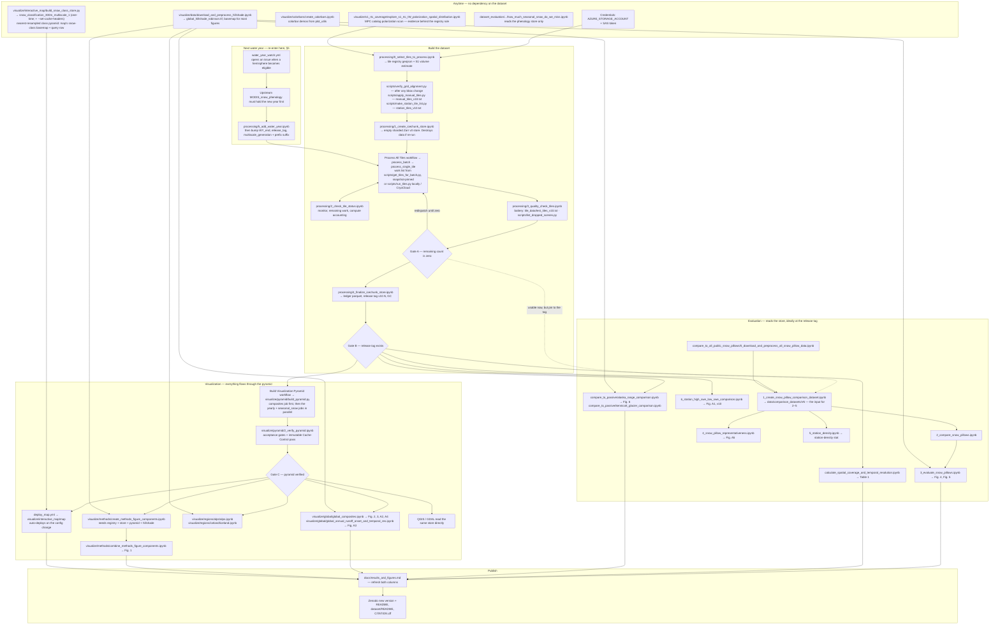

# Maintenance and processing workflow

The operational runbook for this repository: how to (re)build the dataset, run and
babysit the GitHub Actions fleet, add new water years, and maintain the store and
registry. For the *design* — why status lives in icechunk commits, why failures never
commit, how the whole pattern generalizes — see
[`icechunk-github-actions-pattern.md`](icechunk-github-actions-pattern.md). For
mapping outputs to the manuscript, see
[`results_and_figures.md`](results_and_figures.md). Deeper reference for every knob
lives in [`processing/README.md`](../processing/README.md).

Numbered notebooks in `processing/` are the lifecycle, in order:
`0_select_tiles_to_process` → `1_create_icechunk_store` → (fleet runs) →
`2_check_tile_status` → `3_quality_check_tiles` → `4_finalize_icechunk_store`
(release) → `5_add_water_year` (extension).

## 0. Credentials

Everything needs two environment variables (locally) or repo secrets (GitHub Actions):

```bash
export AZURE_STORAGE_ACCOUNT=...        # storage account hosting the icechunk repo
export AZURE_STORAGE_SAS_TOKEN=...      # SAS token with read/write/list/delete on the container
```

The SAS token **expires** — `Config` prints time-to-expiry at load. A fleet dispatched
with a nearly-dead token fails en masse with auth errors; refresh the repo secret
first. Planetary Computer needs no credentials (anonymous + auto-fetched tokens).

## 1. Tile registry (one-time per config era; refresh on demand)

`processing/0_select_tiles_to_process.ipynb` builds
`processing/tile_data/global_tiles_with_seasonal_snow_v10.geojson`:

1. Global grid from the config geobox (asserted against `expected_grid_shape` /
   `expected_tile_grid` tripwires — a sub-pixel bbox edit silently renumbers every
   tile; run `processing/scripts/verify_grid_alignment.py` after any bbox change).
2. Seasonal-snow filter (> 0.001 % Sturm seasonal-snow pixels, via `exactextract`).
3. **S1 VV availability from the MPC GeoParquet catalog index** (per-tile VV item
   counts) → `to_process` flag + `tile_notes`. No manual geographic exclusions; the
   catalog is the authority. Registry keeps excluded rows for documentation;
   `status.get_tile_status_gdf` filters on `to_process`.
4. Manual overrides: `processing/scripts/apply_manual_tiles.py` +
   `tile_data/manual_tiles_v10.txt` force-select tiles the catalog rule missed.
5. Priority subsets: `processing/scripts/make_station_tile_list.py` →
   `tile_data/station_tiles_v10.txt` (tiles containing snow-pillow stations, for
   evaluation-first runs).

The registry is versioned with the config (`valid_tiles_geojson_path` in
`config/global_config_v10.txt`); a v11 would write `..._v11.geojson` and point its
config at it.

## 2. Store initialization (one-time per store version)

`processing/1_create_icechunk_store.ipynb`: metadata-only Zarr v3 template on Azure —
full-extent arrays, shards `(1 water_year, 2048, 2048)` (= exactly one tile × water
year), inner chunks `(1, 256, 256)`, `fill_value = -9999`, water years from the
config (`WY_start`–`WY_end`). Re-initializing **destroys all processed data** — it is
only for new store versions or pre-fleet schema changes. Sanity checks afterward:
the dry-run cell of `processing/5_add_water_year.ipynb`
(`store.extend_water_years(config, repo, dry_run=True)` — should report nothing to
append) and `verify_grid_alignment.py`.

## 3. Running the fleet

```text
GitHub → Actions → "Process All Tiles" → Run workflow
  which_tiles: incomplete          # the only mode you normally need
  tiles_file:  (optional)          # e.g. processing/tile_data/station_tiles_v10.txt
  how_many:    0                   # 0 = no limit
```

- The dispatcher folds icechunk commit history (snapshot-pinned for the whole run),
  emits batches of ≤ 256 tiles, and each tile job processes **only its missing water
  years** then refreshes composites. `incomplete` is idempotent: **re-dispatch until
  the remaining count is zero** — completed work is never redone, failures never
  commit and are simply picked up again.
- Monitor with `processing/2_check_tile_status.ipynb` (authoritative store-derived
  status, per-WY completion, fleet compute accounting, remaining-work list — writes
  the `processing/results/v10/*.csv` snapshots) or `gh run list` for job-level view.
- Single tile: "Process Single Tile" workflow, or locally
  `pixi run python processing/scripts/process_single_tile.py --tile-row R --tile-col C
  --water-years missing`. `--water-years` semantics: `missing` (resume; default in the
  workflows), `all` (recompute + supersede, warned loudly), `none` (composites only),
  or an explicit list. `--local-store PATH` runs the full pipeline against a local
  icechunk repo for testing (single worker only — local FS storage is unsafe for
  concurrent commits).
- Local batch runs (CryoCloud etc.): `processing/scripts/run_tiles.py` — same status
  derivation, no coordination needed beyond the store.

### Failure triage

Only *patterns* deserve investigation; scattered one-off failures are runner
roulette and converge on redispatch.

| Symptom in the job log | Meaning | Action |
| --- | --- | --- |
| `Network is unreachable` on the first external call | Runner boot-time egress failure (hits a few % of runners) | None — jittered retries absorb most; redispatch catches the rest |
| Load dies at exactly the SAS `se=` timestamp (403s, `WarpOperationError`) | Dense year outran the ~45-min MPC token window on a slow runner | Redispatch (fresh runner). Persistent: the year is structurally too big — raise its worker tier in `scale_workers_by_density` or split |
| `over the drop cap ... failing instead of committing a thinned year` | More confirmed-dead scenes (blob 404 but STAC-listed) than the caps allow | Investigate — this is either real archive loss or an outage; caps are `≤3 scenes` and `≤max(1, ceil(5%))` |
| `ALREADY have commits and will be recomputed and superseded` | An explicit-year dispatch is redoing committed work | Fine if intentional (algorithm change); otherwise use `--water-years missing` |
| Same tile failing fast on every redispatch | Real bug | Pull the log; this is how the drop-cap and Severnaya Zemlya issues were found |

Runner facts to remember: ~16 GB RAM (workflows set `MALLOC_ARENA_MAX=2`; dask
workers auto-tier by scene density), 330-min timeout (timeouts are cheap — committed
years survive), throughput varies ~3× between runners.

## 4. Quality checking

- `processing/3_quality_check_tiles.ipynb` — per-tile stats and v9-vs-v10 visual
  comparison for the test-tile battery (antimeridian, scene-densest, Rainier,
  empty-year mix, catalog backfill, Cayambe equator pair). The battery itself is
  `processing/tile_data/test_tiles_v10.txt` — dispatch it through any batch
  workflow's `tiles_file` input to reprocess those eight tiles, then compare here.
  Read its expectations
  cell before alarm: `pct_identical` tracks S1 acquisition redundancy, not
  correctness — the corrected QC filter legitimately changes sparse years.
- `processing/scripts/list_dropped_scenes.py` — global inventory of every scene
  dropped as missing-from-storage, from commit metadata.
- Spot-verify store bytes against commit `stats` (valid-pixel counts must match
  exactly); `2_check_tile_status.ipynb` does this on samples.

## 5. Adding a new water year

The **Water Year Watch** workflow (monthly cron) opens a GitHub issue when a water
year becomes processable for a hemisphere — northern WY N closes Sep 30 N, southern
Mar 31 N+1, plus `trailing_buffer_days = 120` (phenology's own 90-day buffer + fleet
grace). Eligibility is enforced in both the dispatcher and the processor, so nothing
can be committed for a season that hasn't fully elapsed — an ineligible year just
stays `missing` until its date passes. The two hemispheres of the same water year
become eligible ~6 months apart; no manual coordination is needed.

Order of operations (also in the issue template):

1. **Upstream first**: the [`MODIS_snow_phenology`](https://github.com/egagli/MODIS_snow_phenology)
   store must have the new year committed for the eligible hemisphere(s) (it has the
   same watch workflow + its own extend script).
2. Run `processing/5_add_water_year.ipynb`: checks hemisphere eligibility, spot-checks
   that the phenology store actually holds the new year (known snowy windows per
   hemisphere), dry-runs the plan, then does the shard-aligned metadata-only append
   via `store.extend_water_years` (discovers `water_year`-dimensioned arrays by their
   zarr `dimension_names`; verifies the new slab reads as fill).
3. Bump `WY_end` in `config/global_config_v10.txt`, commit, push.
4. Dispatch **Process All Tiles** (`incomplete`) — the new (tile, year) pairs appear
   in the work list automatically; composites go stale and refresh per tile.
5. After the fleet completes: `processing/4_finalize_icechunk_store.ipynb` with a
   bumped tag (`v10.1`, …) — GC + repo-info backup sweep, ledger freeze.
6. **One config edit re-points the whole visualization chain**: set
   `release_tag` to the new tag and increment `multiscale_generation` together with
   the `_multiscale_N` suffix of `global_runoff_multiscale_azure_prefix` (a config
   tripwire asserts the suffix and the generation key agree). Commit, push.
7. Dispatch **Build Visualization Pyramid** (`mode=fresh`; ~7 h, resumable with
   `mode=resume` after a timeout), then run
   `visualize/pyramid/2_verify_pyramid.ipynb` — acceptance gates + the immutable
   `Cache-Control` pass. Delete the previous generation's prefix once the map has
   flipped.
8. Nothing else needs touching: `deploy_map.yml` re-deploys the map on the config
   change (it bakes the config's multiscale prefix into the bundle), and the
   `visualize/global/` figure notebooks read the prefix from the config at run
   time (`global_snowmelt_runoff_onset.pyramid.open_pyramid_level`), writing into `figures/<version>/`.
   The map's seasonal-snow toggle needs no coordination with the pyramid build:
   it probes `{prefix}/0/seasonal_snow_pct/zarr.json` at page load and renders
   disabled until the new generation's `seasonal_snow` job has written the mask,
   so map deploys and pyramid jobs can land in either order.

## 6. Store & repo maintenance

- **After a full fleet run**: `processing/4_finalize_icechunk_store.ipynb` — freezes
  the ledger (lossless export of every commit's metadata), tags the release (`v10.x`;
  tags are GC roots), garbage-collects (dry-run first, then real), sweeps repo-info
  backups, and verifies. Regenerate `processing/results/v10/bulk_processing_stats.csv`
  (final section of `2_check_tile_status.ipynb`) so the manuscript's
  compute-accounting numbers are final (done 2026-08-11 for the initial fleet).
- **Reprocessing after an algorithm change**: newest-wins — just dispatch with
  explicit years (`all` for full recompute); superseded commits remain in history
  until expired. Store-schema changes (new variable, grid change) require a new
  store version instead.
- **Visualization pyramid + map**: the multiscale store at the config's
  `global_runoff_multiscale_azure_prefix` is a disposable derived artifact
  (blobs are served cache-immutable, so it is never mutated in place — every
  rebuild gets a new `_multiscale_N` generation via the config). Build with the
  **Build Visualization Pyramid** workflow, verify + set headers with
  `visualize/pyramid/2_verify_pyramid.ipynb`; the workflow's `seasonal_snow` job
  adds the Sturm & Liston (2021) `seasonal_snow_pct` mask variable (issue #9,
  see `visualize/pyramid/README.md`) and can also run alone, additively,
  against a live prefix (`--check-attrs` gates the root-attr byte stability);
  the interactive map
  (`visualize/interactive_map/map/`, deployed by `deploy_map.yml`) and the global
  figure notebooks both follow the config automatically.
- **Map build dependency**: `deploy_map.yml` builds the map against the
  `egagli/zarr-layer` fork, branch `aux-variables` (checked out adjacent to the
  repo and consumed via a `file:` dependency — the aux-band sampling the
  seasonal-snow shader arm needs isn't in upstream 0.8.0). Deleting or renaming
  that branch breaks map deploys; when the feature lands on the fork's `main`
  (or upstream), update the `ref:` in the workflow and the note in
  `visualize/interactive_map/README.md`.
- **Snow-classification pyramid**: the map's "snow class" basemap and the
  "snow class" row of the point-query card both read the standalone
  `snow_classification_300m_multiscale_1` store, built **once** by
  `visualize/interactive_map/build_snow_class_store.py` (then again with
  `--set-cache-headers`). Ten levels via topozarr `method="nearest"` —
  categorical class codes decimate, never average. It is independent of the
  runoff pyramid and of `multiscale_generation` bumps; it only needs
  rebuilding if the upstream Sturm & Liston raster changes, in which case bump
  its `_N` suffix (same immutable-prefix convention) and `SNOW_CLASS_URL` in
  `visualize/interactive_map/map/lib/store.ts`.
- **GMBA overlay blob** (issue #13): the map's "GMBA mountain ranges" overlay
  lazy-loads `snowmelt_runoff_onset/gmba_v2_standard_300_1.geojson` (gzip
  Content-Encoding, immutable-cached), built and uploaded **once** by
  `visualize/interactive_map/prepare_gmba_overlay.py`. Rebuild only if the
  upstream GMBA inventory changes: bump the `_N` suffix in the script's
  `--dest-blob` and `GMBA_URL` in `map/lib/store.ts` together.
- **Retiring a superseded prefix** (e.g. the pre-pyramid
  `snow_classification_300m_1`, or last generation's
  `..._multiscale_N-1` runoff pyramid): delete only after a **deployed** map is
  reading the new prefix — blobs are served cache-immutable, so a browser that
  already loaded the old prefix keeps using its cached copies until they
  expire, but a fresh page load needs the new one to exist. Verify with
  `curl -sI <new-prefix>/zarr.json` (expect 200), confirm the live map renders,
  then delete:

  ```bash
  # inspect first: how many blobs / how much data
  az storage blob list --account-name uwcryo --container-name snowmelt \
    --prefix snowmelt_runoff_onset/snow_classification_300m_1/ \
    --sas-token "$AZURE_STORAGE_SAS_TOKEN" --query "length(@)"

  # then delete the prefix (irreversible; the store is regenerable from the
  # source GeoTIFF by re-running the builder)
  az storage blob delete-batch --account-name uwcryo --source snowmelt \
    --pattern "snowmelt_runoff_onset/snow_classification_300m_1/*" \
    --sas-token "$AZURE_STORAGE_SAS_TOKEN"
  ```

  Grep the repo for the old prefix string before deleting — nothing but git
  history should still name it.
- **Registry refresh**: rerun the catalog probe in `0_select_tiles_to_process.ipynb`
  when S1 coverage evolves (e.g. Greenland VV backfill); newly-`to_process` tiles
  flow into the next `incomplete` dispatch as wholly-missing tiles.
- **Downstream after data changes**: rerun the evaluation chains
  (`dataset_evaluation/compare_to_all_public_snow_pillows/` notebooks 1→5) and the
  `visualize/` figure notebooks; every manuscript number must land in a `results/`
  CSV via `results.save_result_table` (see
  [`results_and_figures.md`](results_and_figures.md)).

## Known caveats (documented, deliberate)

- **Equator**: tile row 56 overhangs lat 0 by ~2.8 px; the sliver is masked
  (~223 m no-data strip) and the phenology reproject blends hemisphere conventions
  within ~500 m of the equator — materially affects only Volcán Cayambe, which is in
  the test battery. See the "future grid epoch" issue for the alignment fix.
- **No VV polarization** over Greenland/Canadian Arctic: excluded by the registry's
  catalog rule, not by grid extent — the grid already reserves the space for a
  future HH-capable pipeline.
- **Read chunking is deliberately not bit-reproducible against v9** (2048-px reads);
  `--read-chunk-dim 512 --read-chunk-time 10` reproduces v9 exactly when needed.

## Run order, end to end

Everything in the repo, in the order it can be run, with the three gates that unlock
downstream work. Rebuilding from nothing means walking the whole chart; adding a water
year re-enters at **5_add_water_year** and follows the same path down (§5).



### The three gates

| Gate | Condition | What it unlocks |
| --- | --- | --- |
| **A** | `2_check_tile_status` reports zero remaining work | Finalization. Evaluation *can* run against the `main` branch here, but anything whose numbers reach the manuscript should wait for the tag — a later append would otherwise silently change what a rerun produces |
| **B** | `4_finalize_icechunk_store` has created `v10.N` | Everything that reads the dataset: all of `dataset_evaluation/`, and the pyramid build, whose source **must** be a tag, never a branch |
| **C** | `2_verify_pyramid` gates pass and headers are set | Every visualization consumer — the map, the global and regional figure notebooks, the methods figure, and third-party QGIS/GDAL readers |

### Not on the critical path

- **`dataset_utils/`** — `compress_and_download_zarr`, `global_zarr_to_COG`, `split_dataset`,
  `subset_global_dataset` are redistribution utilities still on the **v9 plain-Zarr path**
  (`config.global_runoff_store`, which is `None` for icechunk configs). They need porting
  before they can serve a v10 release. `test_open_zarr_lazy.ipynb` is a standalone smoke test.
- **`dataset_evaluation/compare_to_snotel/`** — v9 Fig. A1 provenance, deliberately pinned to
  v9; the v10 successor is `compare_to_all_public_snow_pillows/6_`. Not rerun per release.
- **Parked** — `compare_to_NorSWE/`, `compare_to_NH-SWE/`, `compare_to_ucla_reanalysis/`.
- **Ad hoc** — `visualize/testing/inspect_tile.ipynb` for single-tile inspection;
  `visualize/testing/test_antimeridian.ipynb` is a closed historical diagnosis, not a QA step.
- **Legacy, part of no current run** — `processing/create_zarr_store.ipynb` (v9 store init),
  `processing/process_tiles.ipynb` and `process_tiles_serverless.ipynb` (v9 Coiled drivers,
  which now raise `AttributeError` against any config), `scripts/consolidate_artifacts.py`
  (v9 CSV status), `scripts/migrate_registry_to_extended_grid.py` (one-shot v9→v10 row shift,
  executed 2026-07-30). Kept for provenance only.
