# Manuscript results and figures

Maps every figure, table, and quoted number in the manuscript to the notebook that
creates it and the durable file where the value lives, with current status. Two value
columns throughout: **v10 (latest, WY2015–2025)** first, then **v9 (published dataset & manuscript, WY2015-2024)**.

## Manuscript figures

<table>
<tr>
<th>Figure</th>
<th width="300">Preview (v10, latest)</th>
<th width="300">Preview (v9, manuscript)</th>
<th>Created in</th>
</tr>
<tr>
<td><b>Fig. 1</b> — workflow diagram</td>
<td width="300"><a href="../visualize/methods/figures/v10/methods_figure.png">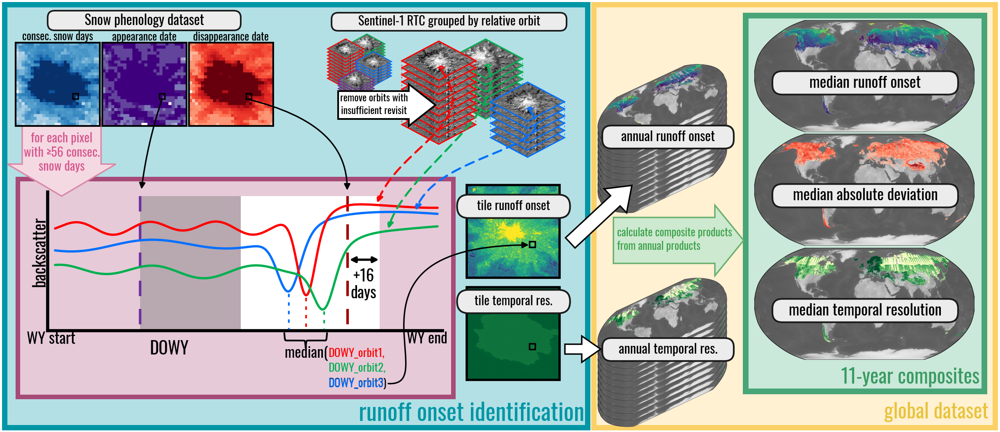</a></td>
<td width="300"></td>
<td><a href="../visualize/methods/create_methods_figure_components.ipynb"><code>create_methods_figure_components.ipynb</code></a> (panels) + <a href="../visualize/methods/combine_methods_figure_components.ipynb"><code>combine_methods_figure_components.ipynb</code></a> (<code>N_YEARS</code> drives the annual-stack sheet counts and the "N-year composites" title)</td>
</tr>
<tr>
<td><b>Fig. 2</b> — global composite products (median onset, MAD, temporal resolution)</td>
<td width="300"><a href="../visualize/global/figures/v10/global_all_composites_robinson_wide.png">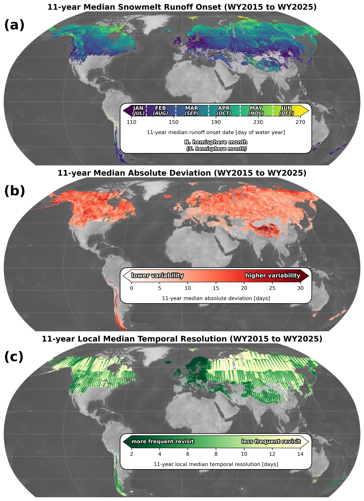</a></td>
<td width="300"></td>
<td><a href="../visualize/global/global_composites.ipynb"><code>global_composites.ipynb</code></a> (<code>…robinson_long.png</code> = alternate aspect variant)</td>
</tr>
<tr>
<td><b>Fig. 3</b> — NH polar stereographic median onset</td>
<td width="300"><a href="../visualize/global/figures/v10/global_composite_median_polar.png">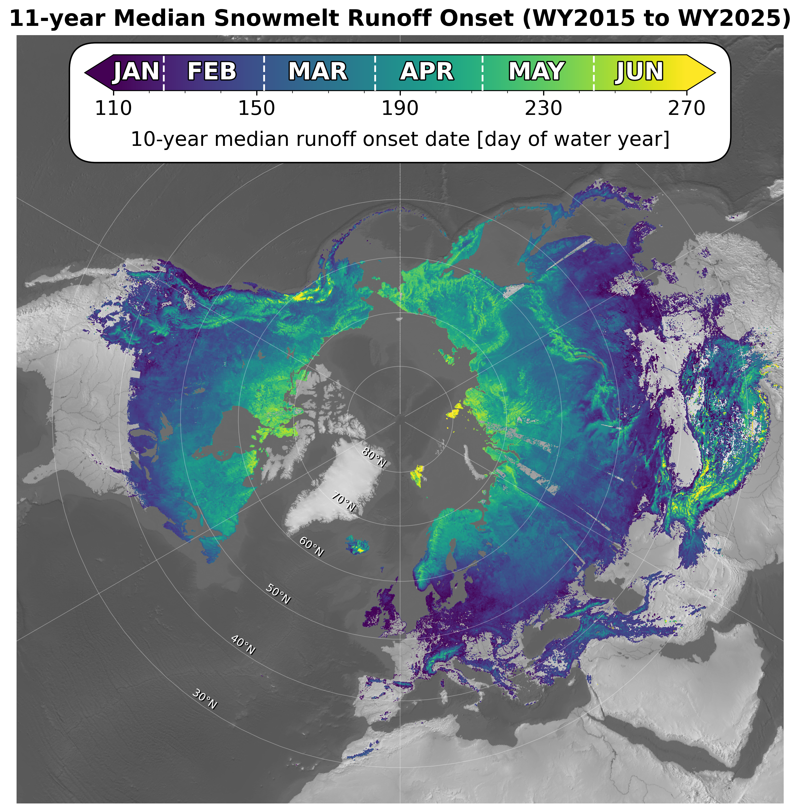</a></td>
<td width="300"><a href="../visualize/global/figures/v9/global_composite_median_polar.png">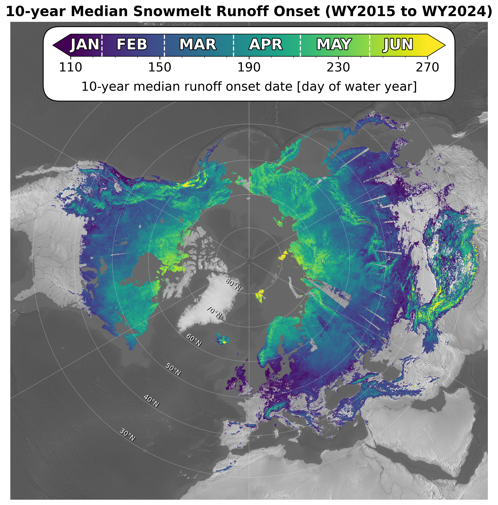</a></td>
<td><a href="../visualize/global/global_composites.ipynb"><code>global_composites.ipynb</code></a></td>
</tr>
<tr>
<td><b>Fig. 4</b> — residual bias/spread binned by forest cover × SWE × temporal resolution</td>
<td width="300"><a href="../dataset_evaluation/compare_to_all_public_snow_pillows/figures/v10/pixelwise_performance_analysis.png">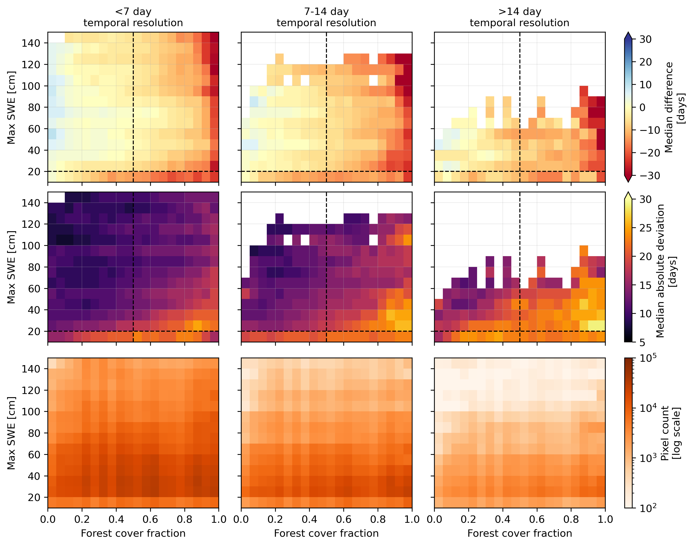</a></td>
<td width="300"><a href="../dataset_evaluation/compare_to_all_public_snow_pillows/figures/v9/pixelwise_performance_analysis.png">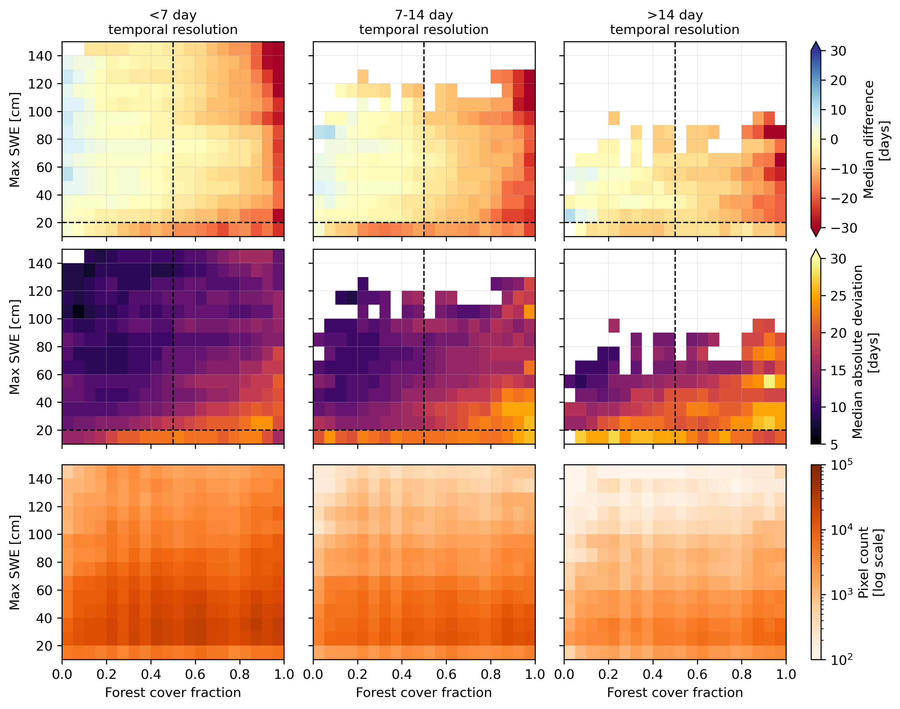</a></td>
<td><a href="../dataset_evaluation/compare_to_all_public_snow_pillows/2_compare_snow_pillows.ipynb"><code>2_compare_snow_pillows.ipynb</code></a> (also writes <code>_WUS</code> / <code>_nonWUS</code> split variants)</td>
</tr>
<tr>
<td><b>Fig. 5</b> — station evaluation (per-year residuals + bias map)</td>
<td width="300"><a href="../dataset_evaluation/compare_to_all_public_snow_pillows/figures/v10/snow_pillow_evaluation_SAR_minus_95pct_of_max_SWE_timing_fcf_lte_50_exclude_worldcover_50_80_max_swe_gte_200_temp_res_lte_14_radius_lte_1000_valid_cnt_1_no_violin_regional_insets.png">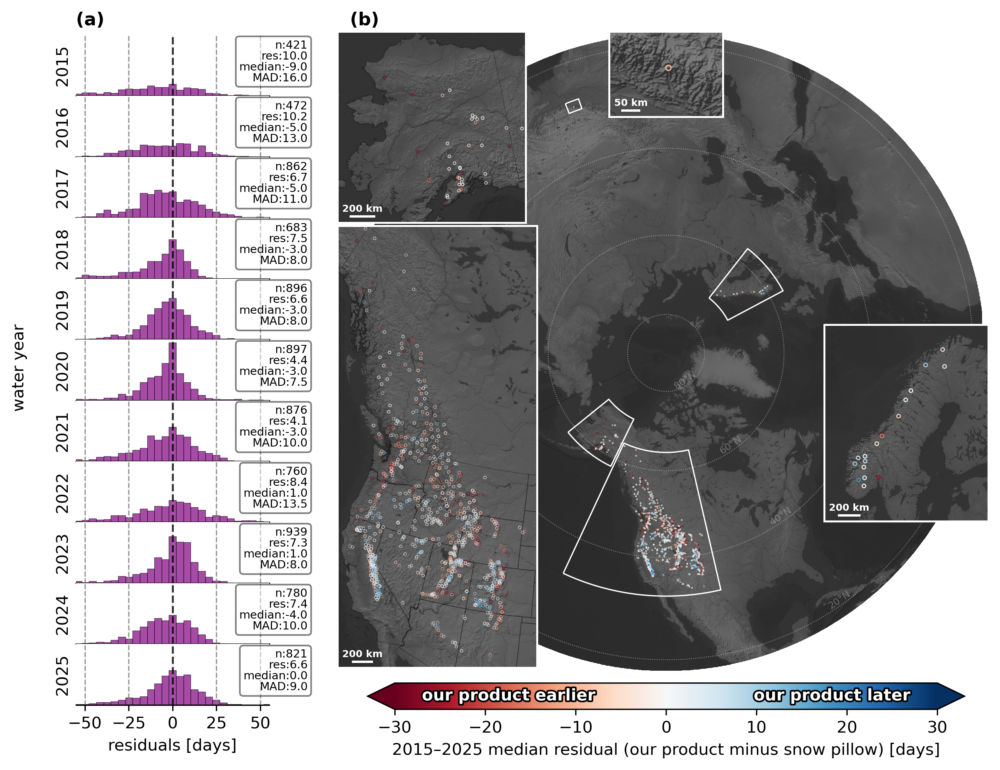</a></td>
<td width="300"><a href="../dataset_evaluation/compare_to_all_public_snow_pillows/figures/v9/snow_pillow_evaluation_SAR_minus_95pct_of_max_SWE_timing_fcf_lte_50_exclude_worldcover_50_80_max_swe_gte_200_temp_res_lte_14_radius_lte_1000_valid_cnt_1_no_violin_regional_insets.png">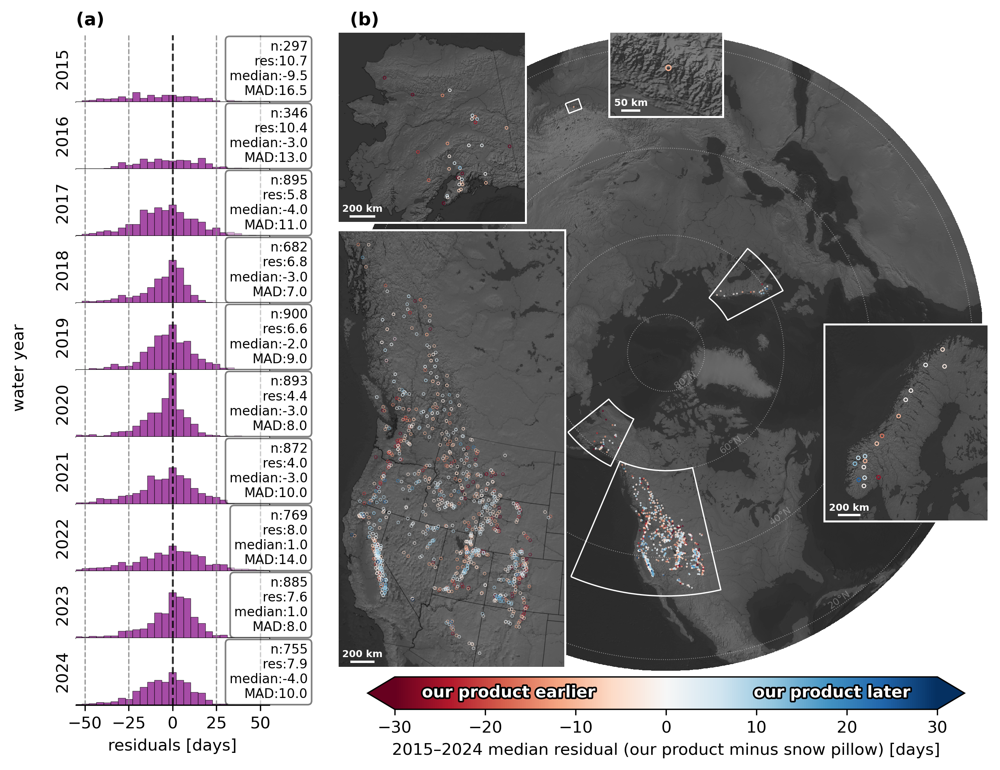</a></td>
<td><a href="../dataset_evaluation/compare_to_all_public_snow_pillows/3_evaluate_snow_pillows.ipynb"><code>3_evaluate_snow_pillows.ipynb</code></a></td>
</tr>
<tr>
<td><b>Fig. 6</b> — passive microwave comparison, Alaska Range WY2020</td>
<td width="300"></td>
<td width="300"><a href="../dataset_evaluation/compare_to_passive/figures/v9/alaska_range_passive_comparison.png">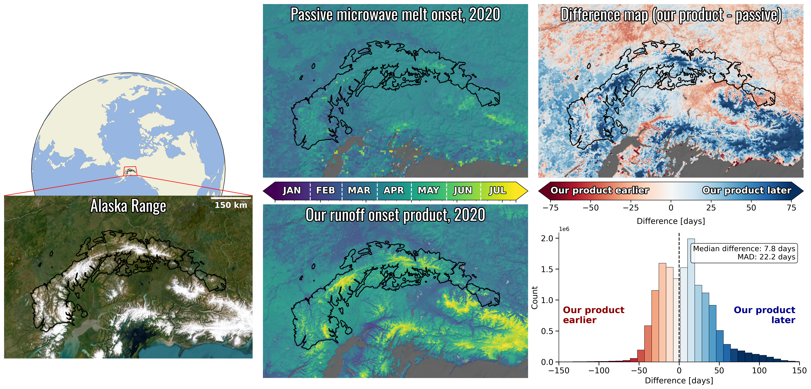</a></td>
<td><a href="../dataset_evaluation/compare_to_passive/alaska_range_comparison.ipynb"><code>alaska_range_comparison.ipynb</code></a></td>
</tr>
<tr>
<td><b>Fig. A1</b> — single-station high-/low-SWE case study</td>
<td width="300"><a href="../dataset_evaluation/compare_to_all_public_snow_pillows/figures/v10/high_swe_low_swe_backscatter_comparison_846_CA_SNTL_2017_2021.png">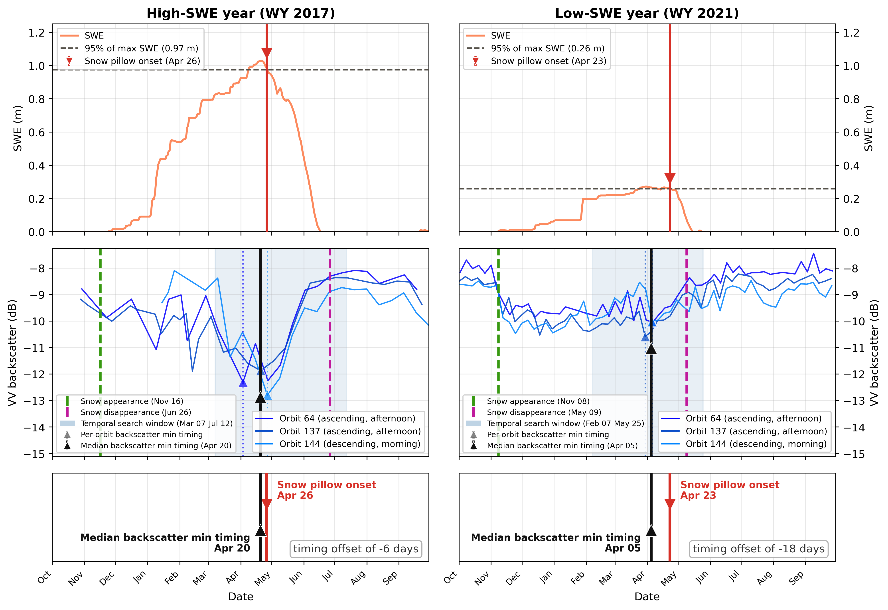</a></td>
<td width="300"><a href="../dataset_evaluation/compare_to_snotel/figures/v9/high_swe_low_swe_backscatter_comparison_846_CA_SNTL_2017_2021.png">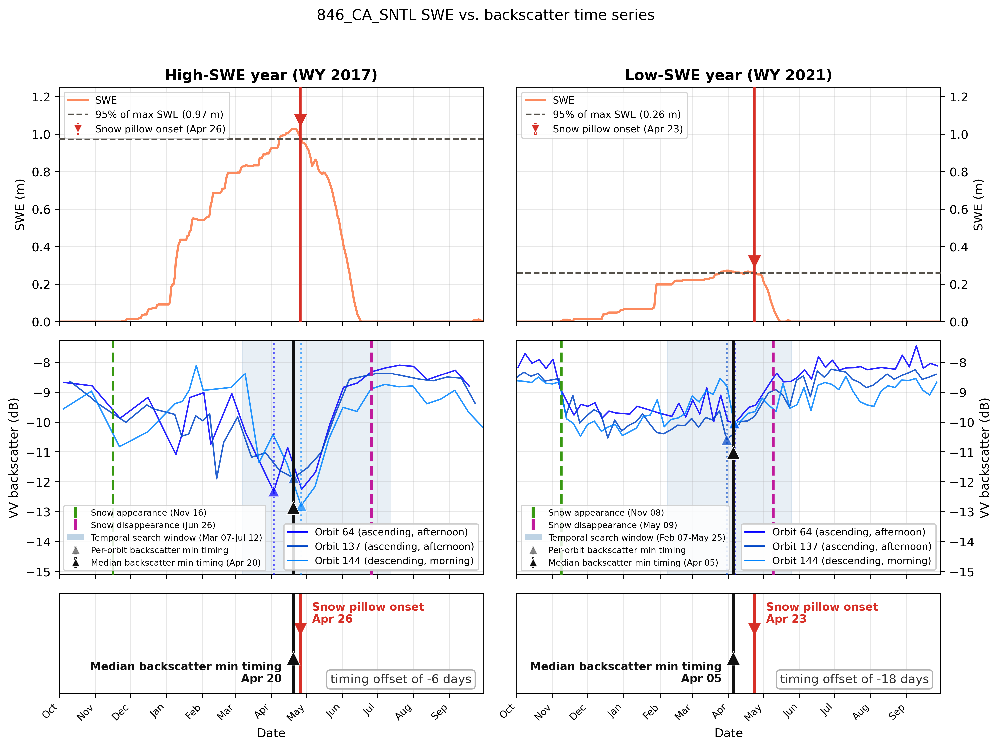</a></td>
<td>v10: <a href="../dataset_evaluation/compare_to_all_public_snow_pillows/6_station_high_swe_low_swe_comparison.ipynb"><code>6_station_high_swe_low_swe_comparison.ipynb</code></a> (rebuilt in the snow-pillow framework; reproduces the v9 onsets/offsets exactly) v9: <a href="../dataset_evaluation/compare_to_snotel/supplemental_figure_methodology.ipynb"><code>supplemental_figure_methodology.ipynb</code></a></td>
</tr>
<tr>
<td><b>Fig. A2</b> — NH polar stereographic, all three composites</td>
<td width="300"></td>
<td width="300"><a href="../visualize/global/figures/v9/global_all_composites_polar.png">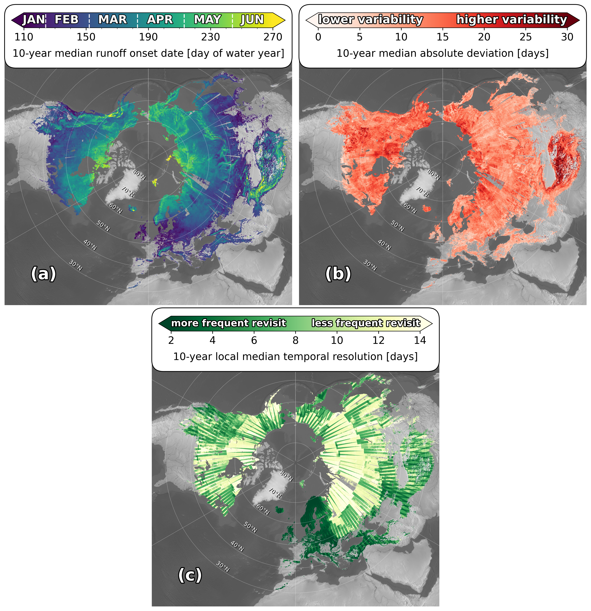</a></td>
<td><a href="../visualize/global/global_composites.ipynb"><code>global_composites.ipynb</code></a></td>
</tr>
<tr>
<td><b>Fig. A3</b> — annual onset + temporal resolution maps</td>
<td width="300"><a href="../visualize/global/figures/v10/global_annual_runoff_onset_and_temporal_res_with_hillshade_2015_2025.png">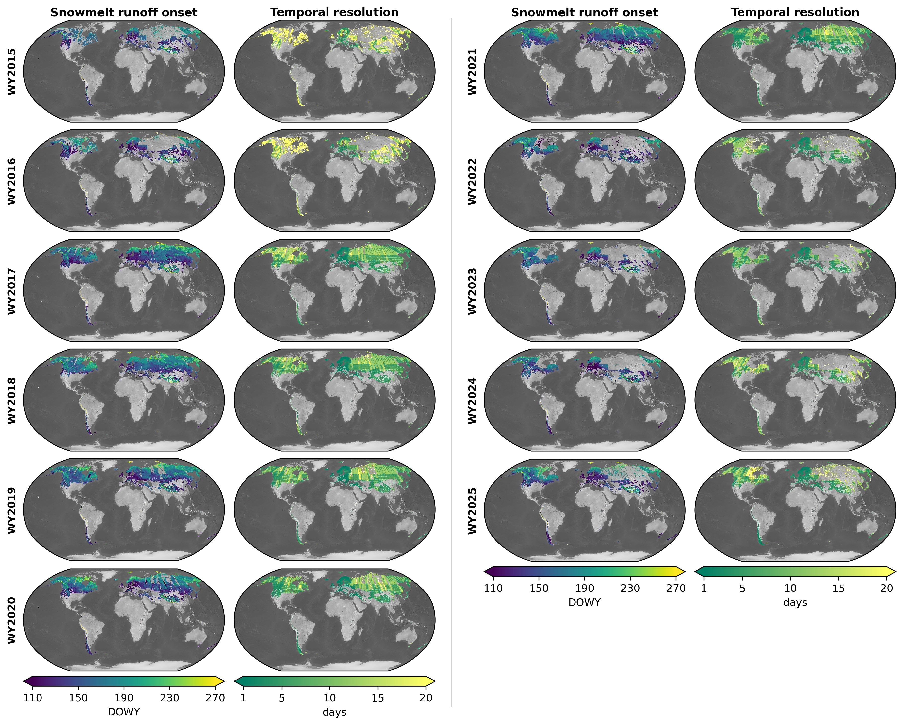</a></td>
<td width="300"></td>
<td><a href="../visualize/global/global_annual_runoff_onset_and_temporal_res.ipynb"><code>global_annual_runoff_onset_and_temporal_res.ipynb</code></a></td>
</tr>
<tr>
<td><b>Fig. A4</b> — per-pixel count of valid water years</td>
<td width="300"><a href="../visualize/global/figures/v10/global_allyrs_annual_runoff_onset_count.png">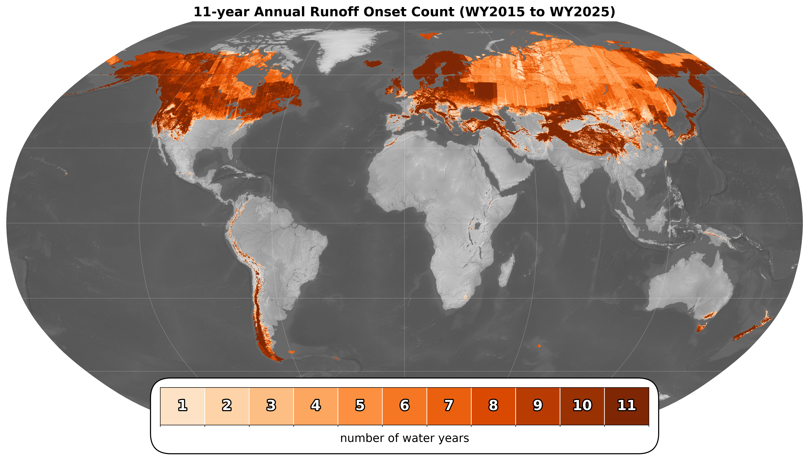</a></td>
<td width="300"><a href="../visualize/global/figures/v9/global_10yr_annual_runoff_onset_count.png">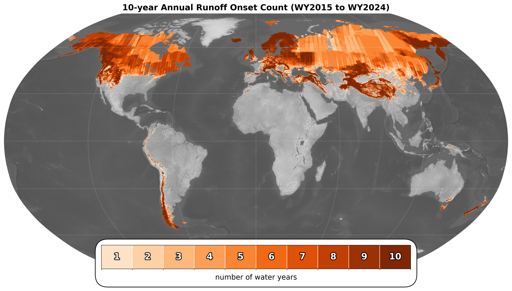</a></td>
<td><a href="../visualize/global/global_composites.ipynb"><code>global_composites.ipynb</code></a></td>
</tr>
<tr>
<td><b>Fig. A5</b> — snow-pillow network representativeness by snow class</td>
<td width="300"><a href="../dataset_evaluation/compare_to_all_public_snow_pillows/figures/v10/snow_pillow_representativeness_snow_class_map_and_pixel_counts.png">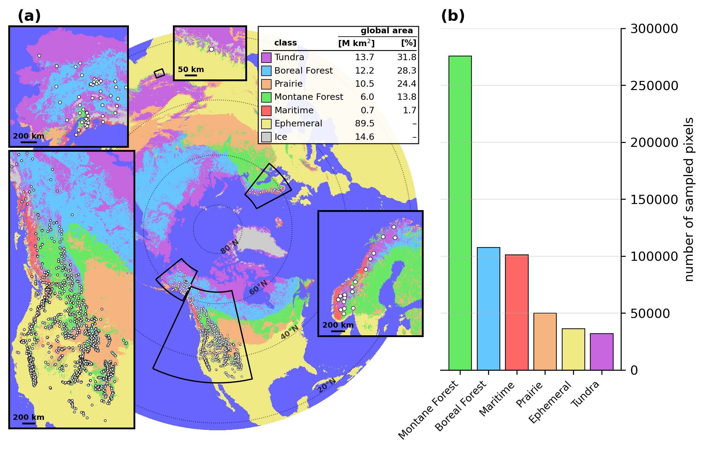</a></td>
<td width="300"><a href="../dataset_evaluation/compare_to_all_public_snow_pillows/figures/v9/snow_pillow_representativeness_snow_class_map_and_pixel_counts.png">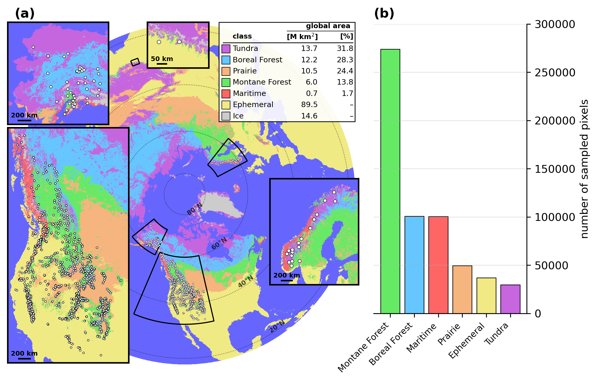</a></td>
<td><a href="../dataset_evaluation/compare_to_all_public_snow_pillows/4_snow_pillow_representativeness.ipynb"><code>4_snow_pillow_representativeness.ipynb</code></a></td>
</tr>
</table>

## Manuscript tables & calculated numbers

| Manuscript item | Value (v10, latest) | Value (v9, manuscript) | Calculated in | Where the number lives |
| --- | --- | --- | --- | --- |
| **Table 1** — per-WY spatial coverage, seasonal snow extent, % coverage, avg temporal resolution | Composite row (**11-year**, WY2015–2025): **37,811,530 km²** of **41,166,484 km²** = **91.9%**, avg temporal resolution **9.0 d**. Per-WY: 29.0% / 15.1 d in 2015 → 41.9% / 10.0 d in 2024 → 46.5% / 7.9 d in 2025. ✅ rerun 2026-08-12 | Composite row: **36,761,636 km²** of **40,863,365 km²** = **90.0%**, avg temporal resolution **9.5 d**. Per-WY values (26.4% / 16.5 d in 2015 → 41.6% / 10.6 d in 2024) match the manuscript exactly | [`calculate_spatial_coverage_and_temporal_resolution.ipynb`](../dataset_evaluation/calculate_spatial_coverage_and_temporal_resolution/calculate_spatial_coverage_and_temporal_resolution.ipynb) | [`..._per_water_year_REVISED.csv`](../dataset_evaluation/calculate_spatial_coverage_and_temporal_resolution/results/v9/complete_spatial_coverage_and_temporal_res_per_water_year_REVISED.csv) — one row per WY + `composite`. Table 1's percentages are the `percent_coverage_of_` `total_seasonal_snow_extent` column (the non-`_REVISED` CSV lacks the excluded-polar-area denominator). v10: [`complete_..._per_water_year.csv`](../dataset_evaluation/calculate_spatial_coverage_and_temporal_resolution/results/v10/complete_spatial_coverage_and_temporal_res_per_water_year.csv) carries both denominators directly — no `_REVISED` variant |
| **Sect. 3.3** — "~1.6 million km² of seasonal snow" excluded (no S1 IW coverage) | **1,663,212 km²** total: Greenland 364,668 + Canadian Arctic 1,235,170 + Russian Arctic 9,101 + Antarctica 54,274 ✅ rerun 2026-08-12 | **1,663,126 km²** total: Greenland 363,919 + Canadian Arctic 1,235,852 + Russian Arctic 9,080 + Antarctica 54,274 | [`how_much_seasonal_snow_do_we_miss.ipynb`](../dataset_evaluation/calculate_spatial_coverage_and_temporal_resolution/how_much_seasonal_snow_do_we_miss.ipynb) | [`seasonal_snow_excluded_area_summary.csv`](../dataset_evaluation/calculate_spatial_coverage_and_temporal_resolution/results/v9/seasonal_snow_excluded_area_summary.csv) — one row per region + "Total Excluded Area" (same file under [`results/v10/`](../dataset_evaluation/calculate_spatial_coverage_and_temporal_resolution/results/v10/seasonal_snow_excluded_area_summary.csv)) |
| **Abstract / Sect. 4.2** — evaluation headline stats | **8,407 station-WYs across 1,136 stations** (WY2015–2025); median **−2.0 d**, MAD **10.0 d**, mean temporal res 7.19 d (combined stats only — the WUS / non-WUS split was dropped 2026-08-10) | **7,294 station-WYs across 1,116 of 1,210 stations** (WY2015–2024); median **−2.0 d**, MAD **10.0 d** — headline stats unchanged, station counts need reconciling | [`3_evaluate_snow_pillows.ipynb`](../dataset_evaluation/compare_to_all_public_snow_pillows/3_evaluate_snow_pillows.ipynb) (filters: fcf ≤ 0.5, max SWE ≥ 20 cm, temporal res ≤ 14 d, radius ≤ 1000 m, WorldCover 50/80 excluded) | [`evaluation_summary.csv`](../dataset_evaluation/compare_to_all_public_snow_pillows/results/v10/evaluation_summary.csv) + [`evaluation_per_water_year.csv`](../dataset_evaluation/compare_to_all_public_snow_pillows/results/v10/evaluation_per_water_year.csv) ✅ v10 |
| **Sect. 2.3** — snow-pillow QC counts | **10,566 valid station-years across 1,234 stations** (of 1,292 stations with SWE data; 1,542 in the raw Zarr) | **9,570 WY observations across 1,210 stations** | [`1_create_snow_pillow_comparison_dataset.ipynb`](../dataset_evaluation/compare_to_all_public_snow_pillows/1_create_snow_pillow_comparison_dataset.ipynb) (QC: SWE ≥ 10 cm, ≥ 60 continuous snow days, gaps ≤ 10 d) | [`qc_station_counts.csv`](../dataset_evaluation/compare_to_all_public_snow_pillows/results/v10/qc_station_counts.csv) ✅ v10 (2026-08-10; values match the v10 column exactly) |
| **Sect. 4.1** — quality-filter thresholds | unchanged | forest cover fraction **< 0.5**, WY max SWE **> 20 cm**, temporal resolution **< 14 d** | Read off the Fig. 4 heatmaps in [`2_compare_snow_pillows.ipynb`](../dataset_evaluation/compare_to_all_public_snow_pillows/2_compare_snow_pillows.ipynb) (a judgment call, not a computed output) | Filter constants at the top of [`3_evaluate_snow_pillows.ipynb`](../dataset_evaluation/compare_to_all_public_snow_pillows/3_evaluate_snow_pillows.ipynb) (`fcf_lte = 50` etc.), baked into the Fig. 5 filename; persisted as columns of [`evaluation_summary.csv`](../dataset_evaluation/compare_to_all_public_snow_pillows/results/v10/evaluation_summary.csv) ✅ and the binned grids in [`pixelwise_binned_stats.csv`](../dataset_evaluation/compare_to_all_public_snow_pillows/results/v10/pixelwise_binned_stats.csv) ✅ v10 |
| **Sect. 2.2.3** — processing scale | **24,500 tiles (100 × 245)**, **4,392** to process (4,227 from the 2026-08-03 catalog probe + 165 manually re-added 2026-08-11 via `manual_tiles_v10.txt` — v9-data tiles in Sturm ephemeral-only zones). Source volume: **1,312,754 unique VV scenes ≈ 2,433 ± 11 TB** (mean asset 1.85 GB, 398 sampled) — ">100 TB" was a ~25× underestimate. Fleet accounting (**final** — fleet ran 2026-08-04 → 2026-08-11): **49,258 tile-year commits** (43,705 data + 5,553 verified-empty) across all **4,392 tiles**, **≈5,936 CPU-core-hours**, **≈68.0 TB read at the 80 m overview**, median 0.91 core-h/tile, mean 15.1 MB/s, all on GitHub Actions (3,899 early commits predate `dest_gb`, so TB-read slightly undercounts) | **23,520 tiles**, **4,453 processed**; median **~4.7 core-h/tile**, **~24,300 core-h** total; **">100 TB"** S1 input (stated estimate) | Tile counts: [`0_select_tiles_to_process.ipynb`](../processing/0_select_tiles_to_process.ipynb); v9 core-hours: [`compress_and_download_zarr.ipynb`](../dataset_utils/compress_and_download_zarr.ipynb); v10 fleet accounting: [`2_check_tile_status.ipynb`](../processing/2_check_tile_status.ipynb) | v9: 4,453 = unique tiles with non-empty `runoff_onsets_dims` in [`tile_results_v9.csv`](../processing/tile_data/tile_results_v9.csv) (of 4,783 registry tiles); core-hours printed in the compress notebook. v10: [`global_tiles_with_seasonal_snow_v10.geojson`](../processing/tile_data/global_tiles_with_seasonal_snow_v10.geojson) (`to_process` counts); [`s1_input_volume.csv`](../processing/results/v10/s1_input_volume.csv) ✅; [`bulk_processing_stats.csv`](../processing/results/v10/bulk_processing_stats.csv) ✅ partial |
| **Sect. 3.1** — grid dimensions | **204,800 × 499,998 px**, 84.05°N – 63.41°S | **195,970 × 499,998 px**, 81.1°N – 60°S. Pixel spacing 7.2 × 10⁻⁴° (~80 m) in both | [`create_zarr_store.ipynb`](../processing/create_zarr_store.ipynb) (v9); [`1_create_icechunk_store.ipynb`](../processing/1_create_icechunk_store.ipynb) + [`store.py`](../global_snowmelt_runoff_onset/store.py) (v10) | v10: asserted literally as `expected_grid_shape` / `expected_tile_grid` in [`config/global_config_v10.txt`](../config/global_config_v10.txt). v9: the published store's array dimensions (from `global_config_v9.txt`'s bbox) |
| **Fig. 6 stats** — passive microwave comparison | Median difference **8.0 d** (ours − passive), MAD **22.0 d**, n = 15,053,672 px ✅ rerun 2026-08-11 | Median difference **7.8 d** (ours − passive), MAD **22.2 d**, Alaska Range WY2020 | [`alaska_range_comparison.ipynb`](../dataset_evaluation/compare_to_passive/alaska_range_comparison.ipynb) (`median_diff` / `mad_diff` in the multipanel cell) | [`passive_comparison_stats.csv`](../dataset_evaluation/compare_to_passive/results/v10/passive_comparison_stats.csv) ✅ v10 (2026-08-11) |
| **Sect. 5.1** — station density, "1 station per ~1200 km²" (WUS mountains) | **994 stations over 1,191,381 km² = 1,198.6 km² per station** (0.083 / 100 km²) — same station source as `4_`; ✅ rerun 2026-08-11 against the refreshed zarr — value unchanged (994 stations, 1,198.6 km²/station) | **~1,200 km²/station** — the typeset proof quotes "1 station per ~1200 km²" (Sect. 5.1), already reconciled during revision. (The original submission's **1,280.7 km²/station** came from 926 SNOTEL/CCSS stations over 1,185,924 km² via the old `easysnowdata` source) | [`5_station_density.ipynb`](../dataset_evaluation/compare_to_all_public_snow_pillows/5_station_density.ipynb) (moved from `compare_to_snotel/` 2026-08-04) | [`station_density.csv`](../dataset_evaluation/compare_to_all_public_snow_pillows/results/v10/station_density.csv) ✅ |
| **Dataset creation methodology (Sect. 2.2)** | — | — | [`processing/`](../processing/README.md), [`global_snowmelt_runoff_onset/`](../global_snowmelt_runoff_onset/README.md) | — |

## Results files (the durable homes of the numbers above)

Convention: every number quoted in the manuscript exists in a `results/` CSV written by the notebook that computes it. Files written through [`global_snowmelt_runoff_onset.results.save_result_table`](../global_snowmelt_runoff_onset/results.py) carry `_version` / `_git_sha` / `_written_at` provenance columns saying exactly which code state produced them. The Status column is as of 2026-08-12; ⏳ = save cell exists but the notebook hasn't been rerun since it was added.

| File | Written by | Contents | Status |
| --- | --- | --- | --- |
| [`complete_spatial_coverage_and_temporal_res_per_water_year_REVISED.csv`](../dataset_evaluation/calculate_spatial_coverage_and_temporal_resolution/results/v9/complete_spatial_coverage_and_temporal_res_per_water_year_REVISED.csv) (+ 3 sibling CSVs) | `calculate_spatial_coverage_and_temporal_resolution.ipynb` | **Table 1** (coverage, extent, %, temporal resolution per WY + composite) | ✅ v9; ✅ v10 (2026-08-12 — [`complete_…_per_water_year.csv`](../dataset_evaluation/calculate_spatial_coverage_and_temporal_resolution/results/v10/complete_spatial_coverage_and_temporal_res_per_water_year.csv) + 2 siblings, no `_REVISED` needed) |
| [`seasonal_snow_excluded_area_summary.csv`](../dataset_evaluation/calculate_spatial_coverage_and_temporal_resolution/results/v9/seasonal_snow_excluded_area_summary.csv) | `how_much_seasonal_snow_do_we_miss.ipynb` | **Sect. 3.3** excluded seasonal-snow area by region | ✅ v9; ✅ v10 (2026-08-12) |
| [`qc_station_counts.csv`](../dataset_evaluation/compare_to_all_public_snow_pillows/results/v10/qc_station_counts.csv) | `1_create_snow_pillow_comparison_dataset.ipynb` | **Sect. 2.3** QC station/station-year counts: **10,566 station-years / 1,234 stations** | ✅ v10 (2026-08-10) |
| [`pixelwise_binned_stats.csv`](../dataset_evaluation/compare_to_all_public_snow_pillows/results/v10/pixelwise_binned_stats.csv) | `2_compare_snow_pillows.ipynb` | **Fig. 4** binned median/MAD/count grids (basis of the Sect. 4.1 thresholds) | ✅ v10 (2026-08-10) |
| [`evaluation_summary.csv`](../dataset_evaluation/compare_to_all_public_snow_pillows/results/v10/evaluation_summary.csv) | `3_evaluate_snow_pillows.ipynb` | **Abstract / Sect. 4.2** headline stats (combined; WUS/nonWUS rows dropped 2026-08-10) + full filter regime | ✅ v10 |
| [`evaluation_per_water_year.csv`](../dataset_evaluation/compare_to_all_public_snow_pillows/results/v10/evaluation_per_water_year.csv) | `3_evaluate_snow_pillows.ipynb` | **Fig. 5** per-water-year n / median / MAD / temporal-resolution table | ✅ v10 |
| [`station_density.csv`](../dataset_evaluation/compare_to_all_public_snow_pillows/results/v10/station_density.csv) | `5_station_density.ipynb` | **Sect. 5.1** WUS station density: **994 stations, 1,198.6 km²/station** | ✅ v10 (2026-08-11) |
| [`passive_comparison_stats.csv`](../dataset_evaluation/compare_to_passive/results/v10/passive_comparison_stats.csv) | `alaska_range_comparison.ipynb` | **Fig. 6** median difference / MAD / pixel count: **8.0 d / 22.0 d / 15,053,672 px** | ✅ v10 (2026-08-11) |
| [`s1_input_volume.csv`](../processing/results/v10/s1_input_volume.csv) | `0_select_tiles_to_process.ipynb` (final section) | **Sect. 2.2.3** S1 input volume: **1,312,754 unique VV scenes ≈ 2,433 ± 11 TB** (replaces ">100 TB") | ✅ v10 |
| [`bulk_processing_stats.csv`](../processing/results/v10/bulk_processing_stats.csv) | `2_check_tile_status.ipynb` | **Sect. 2.2.3** fleet compute accounting from commit history: CPU-core-hours, wall time, TB read at the 80 m overview (`stats.dest_gb`), throughput, peak RSS, platform mix — per WY + totals | ✅ v10 **final** (2026-08-11): 49,258 tile-year commits, ≈5,936 core-h, ≈68.0 TB read |
| [`tile_status.csv`](../processing/results/v10/tile_status.csv) + `{wy_completion_breakdown, commit_outcome_summary, dropped_scenes, remaining_work}.csv` | `2_check_tile_status.ipynb` (final section) | Fleet-diagnostic snapshots (`_written_at`-stamped): one row per `to_process` tile with per-WY status **and per-tile processing stats** (wall/core-hours, GB read, valid px, scenes, throughput, peak RSS, dropped scenes, last processed, retry counts); per-WY completion counts; per-outcome commit rollup (counts, total duration, thinned years, total valid px, max scenes/year, median temporal resolution, platforms); the thinned-year dropped-scene list (`missing_assets`); the dispatcher's remaining-work view | ✅ v10 — final snapshots (fleet complete 2026-08-11) |
